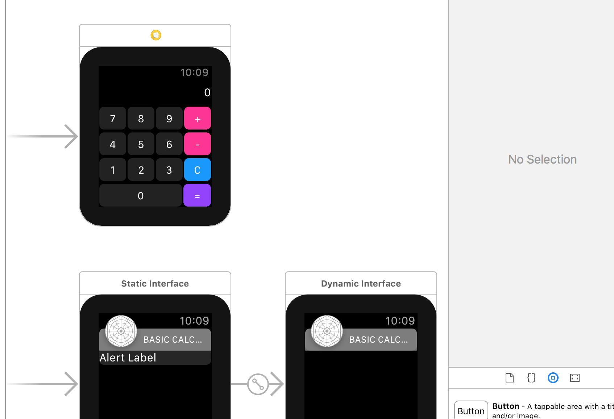

# WatchOS 2 - Basic Calculator

This application was built as an introduction to WatchOS development following a Lynda.com tutorial video.

## Built With

* Xcode 8
* WatchOS 2 / Swift 3

## Authors

* **Lynda.com** - *Initial work* - [WatchOS Course](https://lynda.com)

## License

This project is licensed under the MIT License
